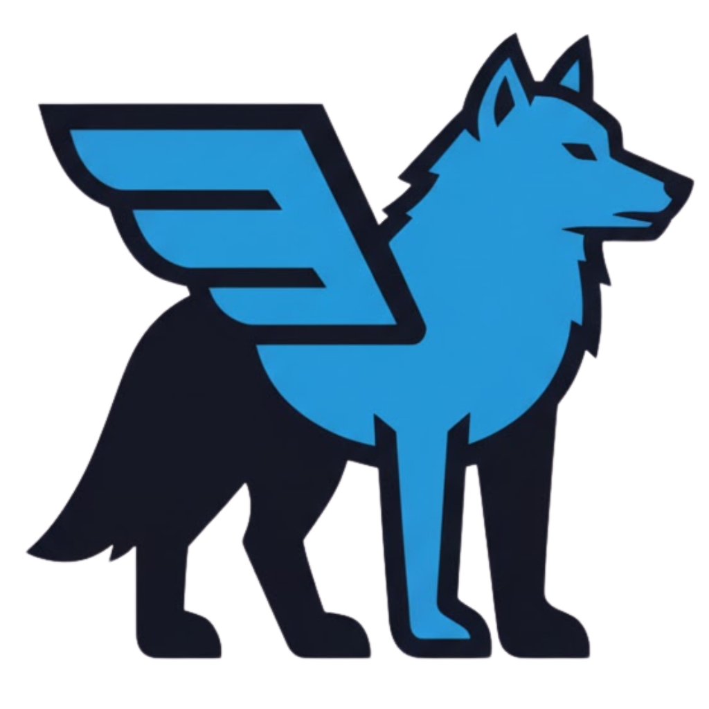
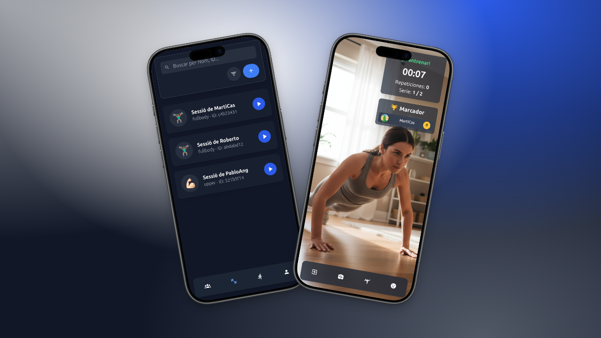
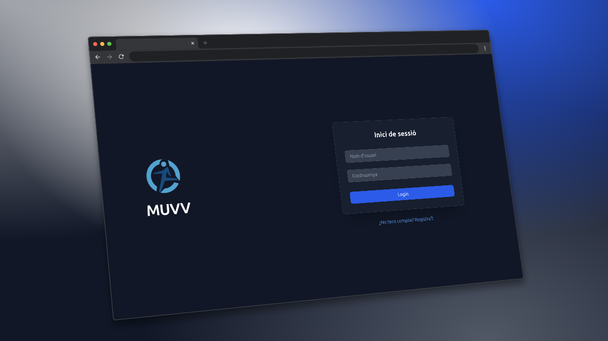

<div align="center">
  
  <h1>MUVV | Aplicació d'exercici en temps real</h1>
</div>

<div align="center">
  <!-- Badges -->
  <a href="https://github.com/inspedralbes/tr1-type-racer-royale-dam_25_26_tr1g1/actions/workflows/deploy.yml">
    
  </a>
  <a href="https://github.com/inspedralbes/tr1-type-racer-royale-dam_25_26_tr1g1/graphs/contributors">
    
  </a>
  <a href="#">
    
  </a>
</div>

**MUVV** és un joc web multijugador que et desafia a moure’t i competir. El seu nom ve de "Move" (moure’s), curt i fàcil de recordar. La doble “V” li dona un toc modern i simbolitza victòria, vigor i vitalitat —perfecte per a una app d’energia i moviment.

A MUVV, has de fer exercicis físics que el sistema detecta amb la càmera i **TensorFlow.js (Pose Detection)**. Pots crear partides, convidar amics i competir per demostrar qui és el més en forma. En resum: **mou-te, juga i guanya!**

<div style="display: flex; justify-content: center; align-items: center; gap: 20px;">
  
  
</div>

## 📜 Taula de Continguts

- [📜 Taula de Continguts](#-taula-de-continguts)
- [✨ Característiques Principals](#-característiques-principals)
- [🛠️ Tecnologies Utilitzades](#️-tecnologies-utilitzades)
  - [**Backend**](#backend)
  - [**Frontend**](#frontend)
  - [**DevOps i Eines**](#devops-i-eines)
- [🚀 Començant](#-començant)
  - [📋 Prerequisits](#-prerequisits)
  - [⚙️ Instal·lació](#️-installació)
- [🐳 Ús amb Docker](#-ús-amb-docker)
- [📁 Estructura del Projecte](#-estructura-del-projecte)
- [🚢 Desplegament](#-desplegament)
- [🧑‍💻 Membres de l'Equip](#-membres-de-lequip)

## ✨ Característiques Principals

- **Detecció de Moviment per IA:** Utilitza TensorFlow.js per analitzar la postura corporal en temps real a través de la càmera web.
- **Sessions Multijugador:** Crea sales privades o uneix-te a sessions públiques per competir amb amics o altres jugadors.
- **Sistema de Puntuació:** Guanya punts per cada repetició correcta i puja en el rànquing de la sessió.
- **Perfils d'Usuari:** Gestiona el teu perfil, mira les teves estadístiques i el teu progrés.
- **Rutines d'Exercicis:** Tria entre diferents rutines d'exercicis segons el teu nivell i objectius.

## 🛠️ Tecnologies Utilitzades

A continuació es detallen les tecnologies, llibreries i eines principals que fan possible **MUVV**.

### **Backend**

- **Node.js**: Entorn d'execució per a JavaScript al servidor.
- **Express.js**: Framework per construir l'API REST.
- **MySQL**: Sistema de gestió de bases de dades relacional.
- **Sequelize**: ORM (Object-Relational Mapper) per interactuar amb la base de dades.
- **WebSockets (`ws`)**: Per a la comunicació bidireccional en temps real durant les sessions.

### **Frontend**

- **Vue.js 3**: Framework progressiu per construir la interfície d'usuari.
- **Vite**: Eina de desenvolupament i empaquetat ultra ràpida.
- **Tailwind CSS**: Framework de CSS "utility-first" per a un disseny ràpid i personalitzat.
- **Pinia**: Gestor d'estats per a Vue.js.
- **Vue Router**: Llibreria de routing oficial per a Vue.js.
- **TensorFlow.js (`Pose-Detection`)**: Per a la detecció de postures corporals en temps real mitjançant la càmera web.

### **DevOps i Eines**

- **Docker & Docker Compose**: Per a la containerització i orquestració de l'aplicació.
- **Nginx**: Servidor web utilitzat com a reverse proxy en producció.
- **GitHub Actions**: Per a la integració i desplegament continus (CI/CD).
- **Certbot**: Per a la gestió de certificats SSL/TLS (HTTPS).
- **Adminer**: Eina lleugera per a la gestió de la base de dades.

## 🚀 Començant

Per executar aquest projecte localment, segueix els passos següents.

### 📋 Prerequisits

Assegura't de tenir instal·lat el següent programari:

- [Git](https://git-scm.com/)
- [Docker](https://www.docker.com/get-started)
- [Docker Compose](https://docs.docker.com/compose/install/)

### ⚙️ Instal·lació

1.  **Clona el repositori:**

    ```bash
    git clone https://github.com/inspedralbes/tr1-type-racer-royale-dam_25_26_tr1g1.git
    cd tr1-type-racer-royale-dam_25_26_tr1g1
    ```

2.  **Configura les variables d'entorn:**
    El projecte utilitza diferents arxius `.env` per a la configuració. Hauràs de crear-los manualment a partir dels exemples.

    - **Backend:** Crea un arxiu anomenat `.env.development` dins de la carpeta `backend/` amb el següent contingut:

      ```env
      PORT=5000
      CORS_ORIGIN=http://localhost:3000
      DB_HOST=tr1-mysql
      DB_DATABASE=muvv-database
      DB_USER=user
      DB_PASSWORD=password
      DB_PORT=3306
      ```

    - **Frontend:** Crea un arxiu anomenat `.env.development` dins de la carpeta `frontend/` amb el següent contingut:
      ```env
      VITE_API_URL=http://localhost:5000
      VITE_WS_URL=ws://localhost:5000
      ```
      > **Nota:** Les variables del frontend a `docker-compose.yml` sobreescriuen les de l'arxiu `.env.development` quan s'executa amb Docker.

## 🐳 Ús amb Docker

La forma més senzilla d'executar l'aplicació completa (frontend, backend i base de dades) és amb Docker Compose.

1.  **Aixeca els contenidors:**
    Aquest comandament construirà les imatges i iniciarà els serveis en segon pla.

    ```bash
    docker-compose up -d --build
    ```

2.  **Accedeix als serveis:**

    - **Frontend:** [http://localhost:3000](http://localhost:3000)
    - **Backend:** [http://localhost:5000](http://localhost:5000)
    - **Adminer (Gestor de BD):** [http://localhost:8080](http://localhost:8080)

3.  **Atura els contenidors:**
    ```bash
    docker-compose down
    ```

## 📁 Estructura del Projecte

```
.
├── backend/        # Codi del servidor (Node.js, Express)
├── data/           # Dades persistents (certificats SSL, etc.)
├── frontend/       # Codi del client (Vue.js, Vite)
├── nginx/          # Configuració de Nginx per a producció
├── docker-compose.yml      # Orquestració de contenidors per a desenvolupament
├── docker-compose.prod.yml # Orquestració de contenidors per a producció
└── README.md
```

## 🚢 Desplegament

Per a producció, s'utilitza el fitxer `docker-compose.prod.yml`, que inclou un contenidor de Nginx com a reverse proxy i gestiona els certificats SSL amb Certbot.

El desplegament està automatitzat amb **GitHub Actions** a través del workflow definit a `.github/workflows/deploy.yml`.

## 🧑‍💻 Membres de l'Equip

- Martí Castaño Rodríguez
- Angel Cuadra Acosta
- Fiona Mondelo Giaramita
- Roberto Lotreanu
